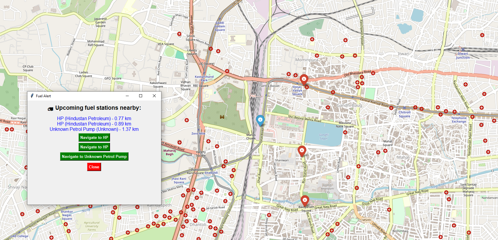
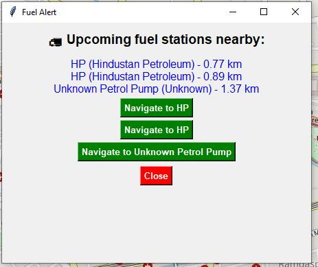
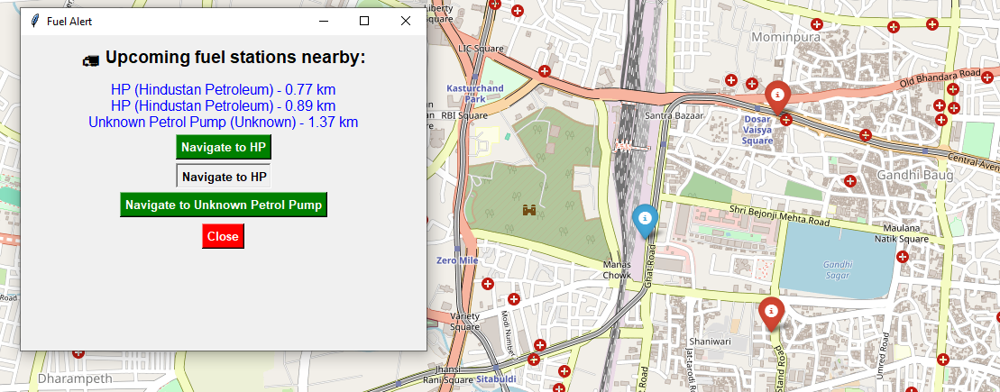
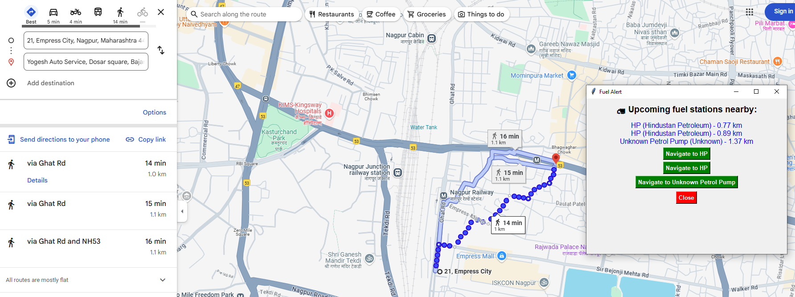

# Fuel-Station-Alert-System
Fuel Station Alert System is a Python-based application that suggests the three nearest fuel stations to users. It provides pop-up notifications and voice alerts for quick assistance, ensuring a smooth refueling experience.
<h3>Logic of project</h3>
The project includes direct working with the Google Maps.
Voice Alerts: For accessibility, a voice alert announces the nearest fuel stations, ensuring users don't have to read the pop-ups manually.  

<h3>The working of the project</h3>
<ul><li>As you can see the<b> above screenshot</b> where the Fuel alert pop-up,Map redirection is been displayed.
<li>Live Tracking: The system continuously tracks the vehicle's location.'</i>.
<li>Simultaneous Map Redirection: While showing pop-ups, it also redirects to a map view for better visualization.</ul>

